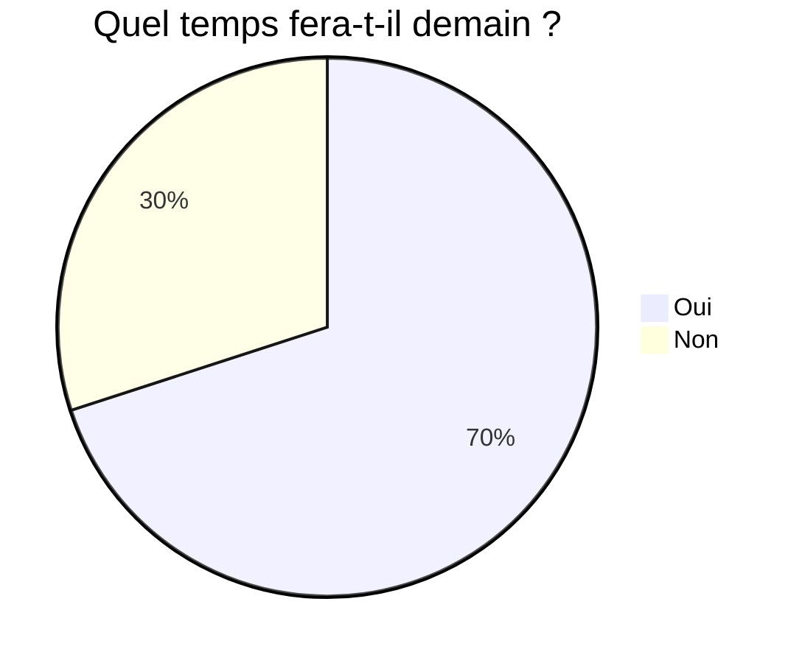

# 2024-03-12 Chantier culture commune

- mise à jour de la participation à la liste

- adhésion

## Séminaire du 5 juin

### Architecture et intervenant·es

L’architecture retenue pour la journée est la suivante:

- une introduction à la journée revenant sur le traitement par l’institut de recherche de la question de la culture commune - **Paul** 

- la matinée consacrée à  « la culture commune contre la ségrégation des parcours, l’individualisation, la méritocratie »
  - une introduction revenant sur l’histoire de l’unification du système scolaire (intervenant·e) - **Patrick Rayou / Agnès Van Zanten** (Adrien se charge du contact)
  - une table-ronde pour traiter des mécanismes de ségrégation à l’oeuvre aujourd’hui
    - la fin du collège unique - **André Tricot** (Sandrine se charge du contact)
    - les fondamentaux et l’individualisation du traitement de la difficulté scolaire au primaire - **Adrien**
    - Parcoursup - Remermier (j’ai oublié de noter le prénom…) (Paul se charge du contact)

- l’après-midi consacrée à « la culture commune contre les dominations: un point de vue intersectionnel »
  - classe - **Meyra Mamede** (Christine se charge du contact)
  - race - **Choukri Ben Ayed** (Christine se charge du contact)
    plan B Matthieu Ychoux, Joanie Cayou, Fabrice Dume
  - genre - **Vanina Mozziconacci** (Adrien se charge du contact)
    plan B Fanny Gallot
  - une synthèse intersectionnelle - **Séverine Chauvel** (Adrien se charge du contact)

Quelques plans B:

- Anne-Christine Oller
- Filipo Pirone

### Titre et présentation de l’évènement et aspects organisationnels

Une proposition de titre à discuter:

- Chantier culture commune 1 : école et dominations

Adrien est en charge de l’écriture du texte de présentation de l’évènement
Paul fera un visuel.

Il n’y avait pas de salles dispo à la FSU. du coup nous tiendrons le séminaire à Cabanis dans les locaux du SNUipp.

## Participation au chantier et adhésion à l’institut

Depuis les débuts du chantier, le turnover a été important des personnes participant à nos réunions physiques ou en visio. À ce jour, nous n’avons pas toiletté la liste mail du chantier, et peut-être que certaines personnes moins engagées quà une certaine période souhaiterait être allégée de la réception des envois de la liste.

Si c’est le cas, vous pouvez me le signifier pour que le nécessaire soit fait.

Par ailleurs, il semblerait, d’après un benchmark des différents chantiers de l’institut, que nous sommes très mal classé en termes de proportion d’adhérent·es à l’institut parmi les participant·es du chantier. Pour résoudre ce problème et gagner le trophée de meilleur chantier du mois, il suffit de payer une modeste cotisation. Je vous enverrai le bulletin d’adhésion et les modalités dans un mail ultérieur.

